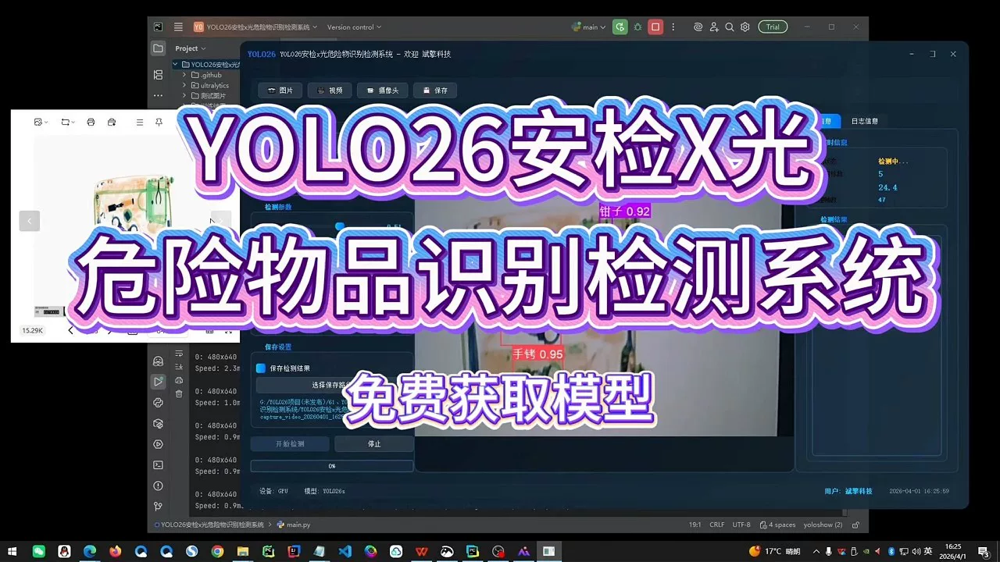
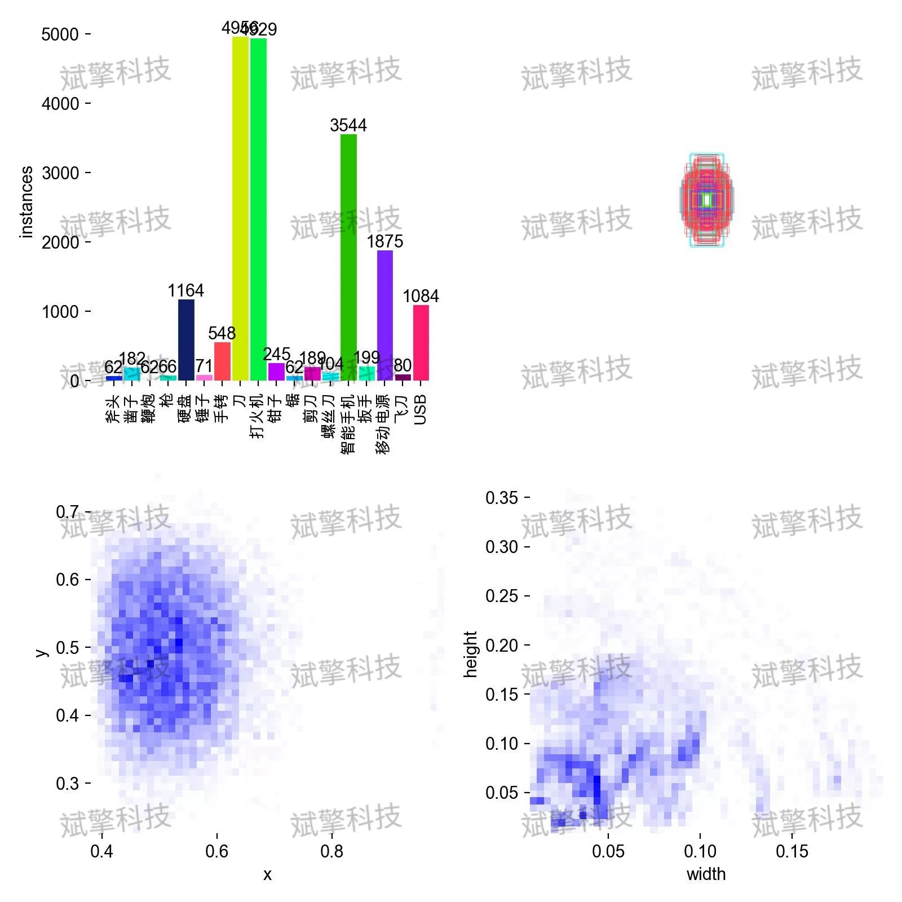
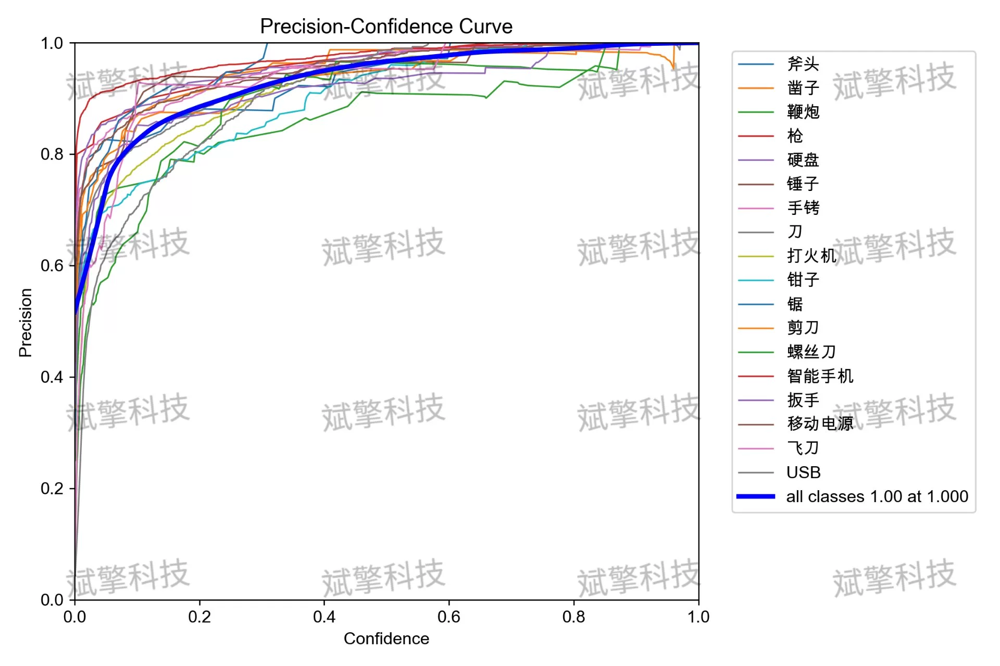
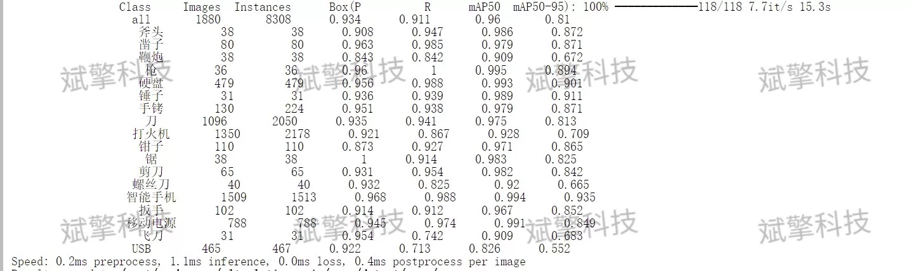
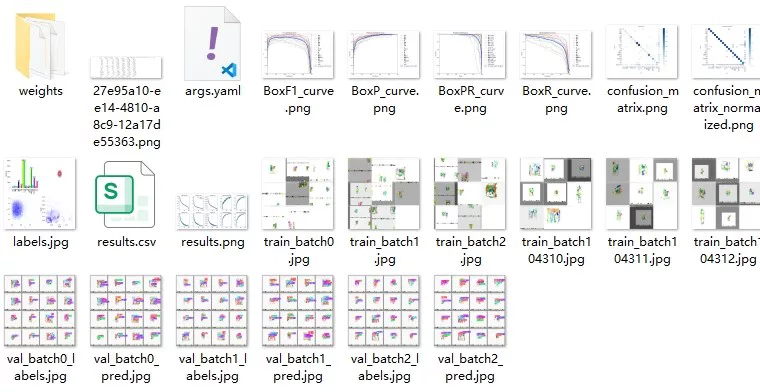
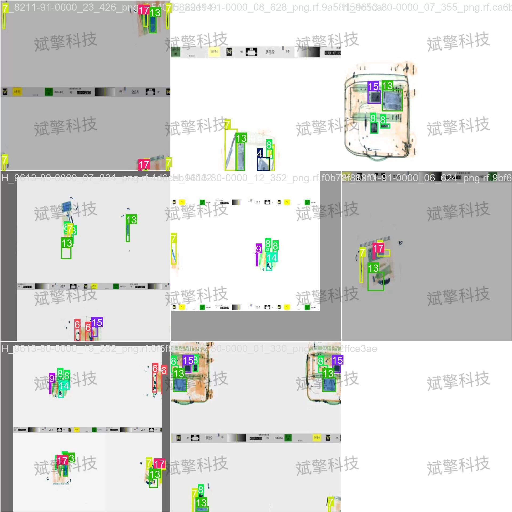
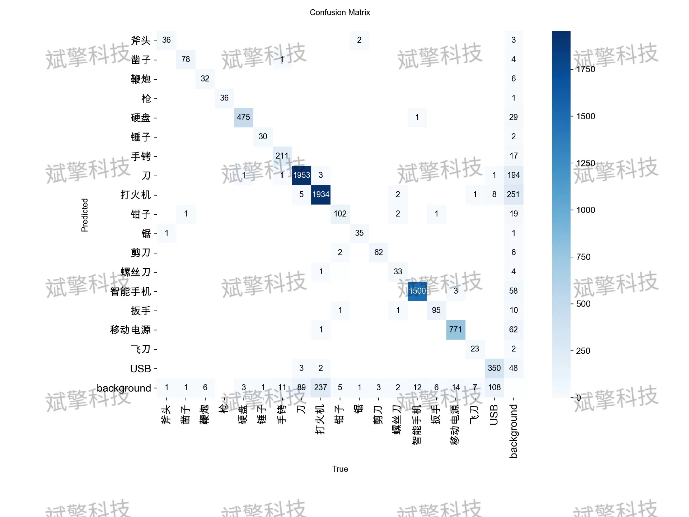
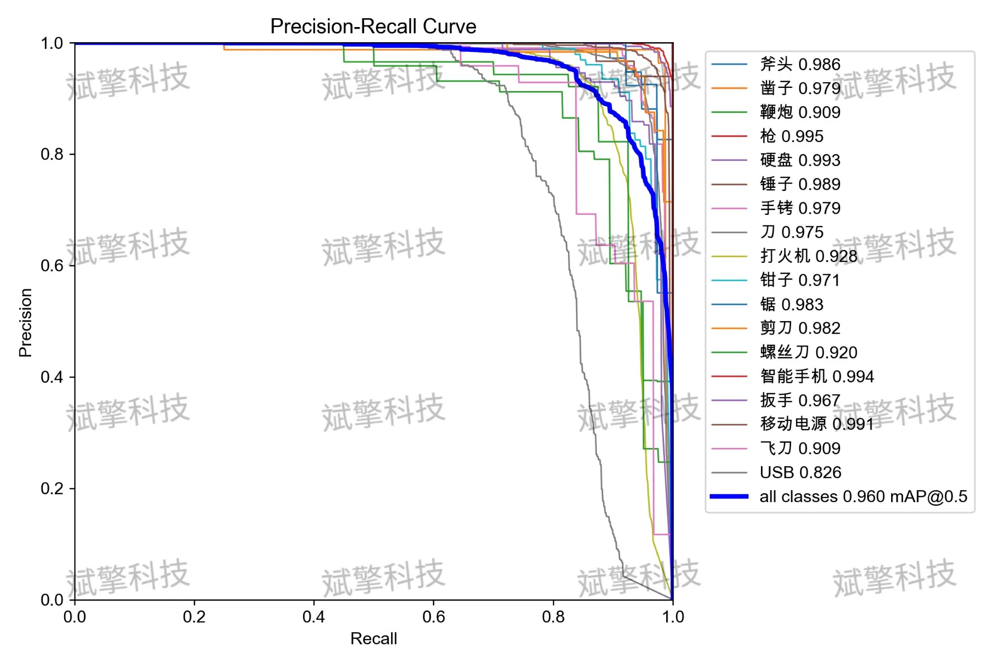
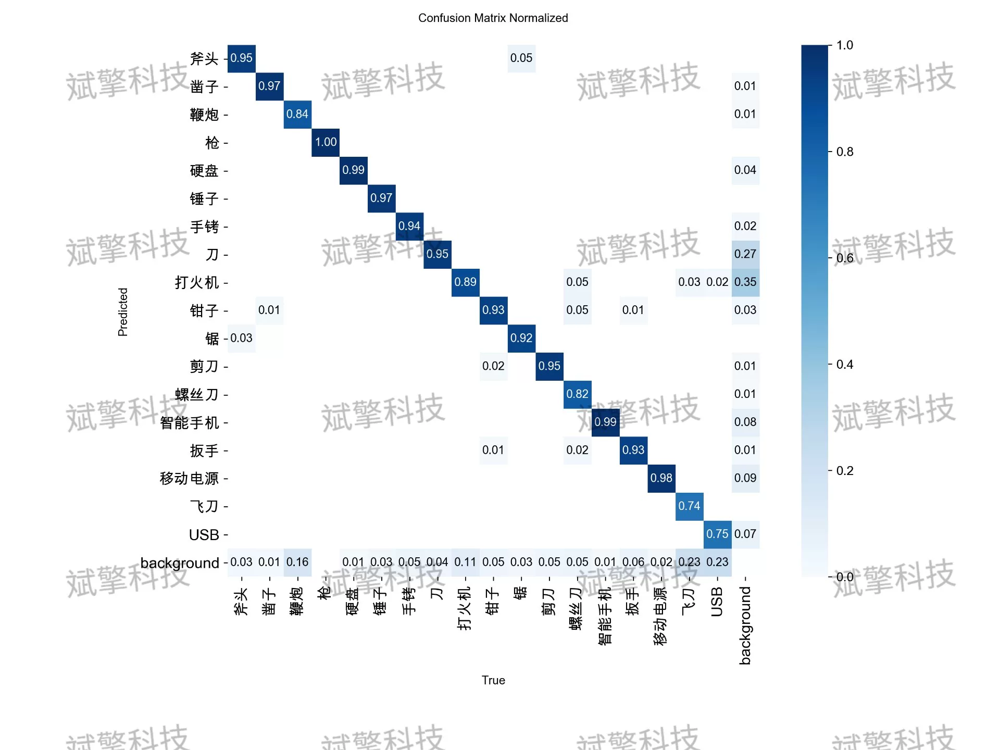

# YOLO26 security X-ray hazardous goods detection system | source code

## Body

YOLO26 X-ray Inspection and Hazardous Goods Detection System | Source Code Based on YOLOv26 for X-ray Inspection of Dangerous Goods, Real-time Recognition of Blades/Firearms/Explosives with Accuracy of 96%

This article introduces a X-ray inspection and automatic recognition detection system for hazardous goods based on the YOLOv26 architecture. The system aims to solve the problems of low efficiency and easy fatigue in traditional manual inspection, resulting in missed checks. A specialized X-ray dataset containing 18 common prohibited items and restricted carry items was constructed, covering blades, firearms, explosives, and everyday electronic devices. Experimental results show that the model achieves excellent performance on the validation set, with mAP@50 reaching 96%, and the inference speed meets real-time requirements. It performs particularly well in detecting categories such as firearms, smartphones, mobile power banks, etc. The system has potential for practical deployment at airports, subways, and other public transportation hubs.

The dataset contains 18 target categories, covering the main prohibited items and items that require special attention. The specific category names are as follows:
Axe - Axe
Chisel - Chisel
Firecracker - Fireworks
Gun - Gun
HDD - Hard Drive
Hammer - Hammer
HandCuffs - Handcuffs
Knife - Knife
Lighter - Lighter
Plier - Plier
Saw - Saw
Scissors - Scissors
Screwdriver - Screwdriver
SmartPhone - Smartphone
Spanner - Wrench
SupplymentaryBattery - Mobile Power Bank
Throwing Knife - Flick knife
USB - USB Flash Drive/Data Cable

Free reservation for remote installation. Unsuccessful installation will result in full refund.
Purchase comes with the following resources (accessible through Baidu Cloud):
YOLO Identification Detection Project Complete Source Code
YOLO format datasets
Training code + UI interface code
Trained model + results images
Software install package
Add WeChat to make an appointment for remote installation (auto-show WeChat ID after purchase) — Unsuccessful Installation, Full Refund

⚙️ Core Function Modules
Detection Capability
Image detection: Upon upload, return detection boxes + category information
Video detection: Supports video files, analyzes frames accurately
Camera real-time detection: Connects to USB cameras, realizes dynamic monitoring
Interaction and Control
Target selection: Choose one or more categories for detection
Parameter real-time adjustment: Adjustable confidence threshold & IoU threshold, flexible control of accuracy
Result saving: Save images/videos/camera detection results in one click
System and Data
User login registration: Supports password strength detection + encryption storage
Log recording: Auto-record operation and error information (timestamped)

## Images

## Payment

Here is a pay link on Stripe ( https://buy.stripe.com/3cs8yP7sY87d0vu9AB ). Please contact me lonlonago@foxmail.com after funding $89, and I will send you a complete data files , thank you!

